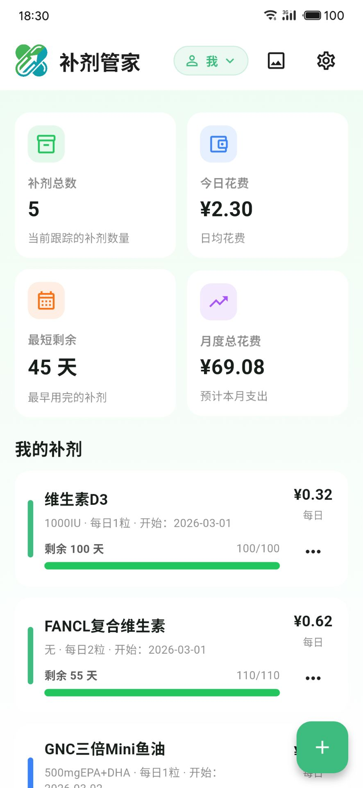

<div align="center">

# 补剂管家

[](https://flutter.dev)
[](LICENSE)

**智能营养补剂库存与花费管理工具**

[功能特性](#功能特性) • [下载安装](#下载安装) • [快速开始](#快速开始) • [技术架构](#技术架构)

</div>

---

## 简介

补剂管家是一款基于 Flutter 开发的跨平台应用，帮助用户高效管理营养补剂的库存、追踪每日花费，并通过数据可视化分析消费习惯。支持多用户档案，适合家庭或团队共同使用。

<div align="center">

</div>

## 功能特性

### 核心功能

| 功能       | 描述                                                       |
| ---------- | ---------------------------------------------------------- |
| 补剂管理   | 记录补剂名称、规格、每日用量、购买价格、剩余库存等详细信息 |
| 智能统计   | 实时显示补剂总数、今日花费、最短剩余天数、月度总花费       |
| 库存提醒   | 当补剂剩余天数 ≤ 14 天时自动提示库存不足                   |
| 数据可视化 | 月度花费分布（环形图）+ 花费趋势（折线图）                 |
| 多档案支持 | 支持创建多个用户档案，数据相互独立                         |

### 平台支持

- [x] Android (APK)
- [x] Windows (安装程序)
- [x] macOS (DMG)
- [x] Web (浏览器)
- [x] iOS (需自行构建)
- [x] Linux (需自行构建)

## 下载安装

### 预编译版本

从 [GitHub Releases](https://github.com/bryce/supplement-tracker/releases) 下载最新版本：

| 平台    | 下载   | 说明              |
| ------- | ------ | ----------------- |
| Android | `.apk` | 支持 Android 5.0+ |
| Windows | `.exe` | 自动安装程序      |
| macOS   | `.dmg` | 拖拽安装          |

### 验证文件完整性

所有发布文件均附带 SHA-256 校验和，可在 `sha256.txt` 中验证：

```bash
sha256sum -c sha256.txt
```

## 快速开始

### 环境要求

- Flutter SDK >= 3.0.0
- Dart SDK >= 3.0.0
- Android SDK (如需构建 Android 版本)
- Xcode (如需构建 iOS/macOS 版本)

### 本地运行

```bash
# 克隆仓库
git clone https://github.com/bryce/supplement-tracker.git
cd supplement-tracker

# 安装依赖
flutter pub get

# 运行应用
flutter run -d windows    # Windows
flutter run -d chrome     # Web
flutter run               # 连接的设备/模拟器
```

### 构建发行版

```bash
# Android APK
flutter build apk --release

# Windows
flutter build windows --release

# macOS
flutter build macos --release

# Web
flutter build web --release
```

## 技术架构

### 项目结构

```
lib/
├── main.dart                      # 应用入口
├── src/
│   ├── app.dart                   # 应用配置
│   ├── theme/
│   │   └── app_theme.dart         # 主题定义
│   ├── models/
│   │   ├── supplement.dart        # 补剂数据模型
│   │   └── profile.dart           # 用户档案模型
│   ├── services/
│   │   └── supplements_store.dart # 本地存储服务
│   ├── controllers/
│   │   └── supplements_controller.dart  # 业务逻辑控制
│   ├── ui/
│   │   ├── home/home_screen.dart              # 主界面
│   │   ├── supplement_editor/                 # 补剂编辑弹窗
│   │   └── profile/                           # 档案管理
│   ├── widgets/
│   │   ├── charts/                # 图表组件
│   │   ├── stat_card.dart         # 统计卡片
│   │   ├── supplement_card.dart   # 补剂卡片
│   │   ├── reminder_list.dart     # 提醒列表
│   │   └── empty_state.dart       # 空状态提示
│   └── util/
│       ├── format.dart            # 格式化工具
│       └── colors.dart            # 颜色工具
```

### 技术栈

- **框架**: Flutter 3.41.2
- **状态管理**: StatefulWidget + ChangeNotifier
- **本地存储**: `shared_preferences`
- **数据持久化**: JSON 序列化
- **CI/CD**: GitHub Actions

## 开发指南

### 代码规范

```bash
# 静态分析
flutter analyze

# 运行测试
flutter test

# 代码格式化
flutter format lib/
```

## 开源协议

本项目采用 [MIT 协议](LICENSE) 开源。

## 致谢

- [Flutter](https://flutter.dev/) - 跨平台 UI 框架
- [Material Design](https://material.io/) - 设计语言

---

<div align="center">

Made with ❤️ by Bryce

</div>
